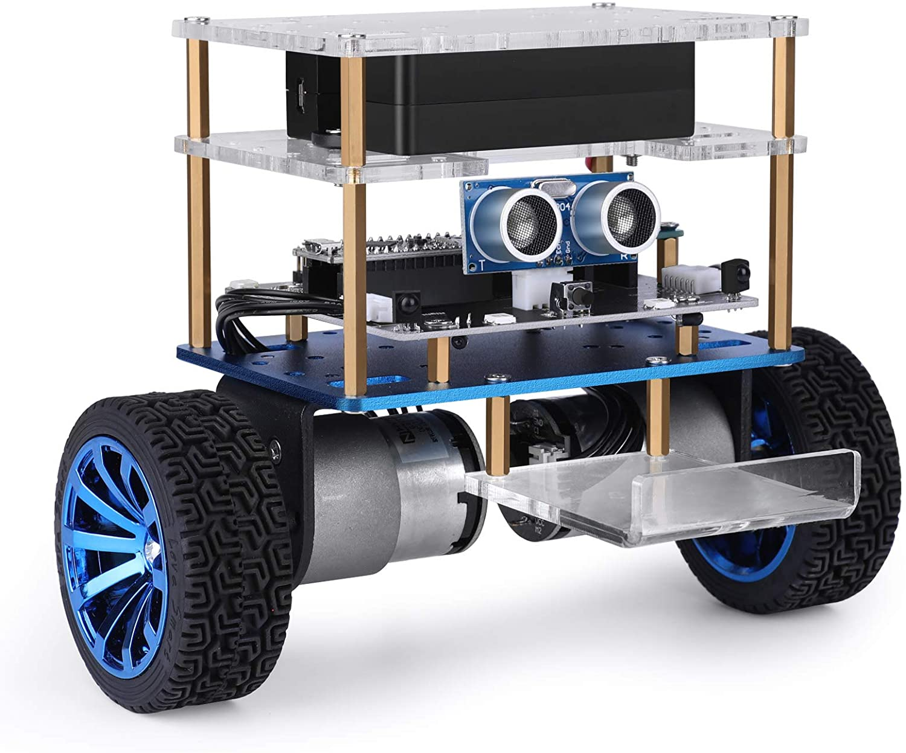
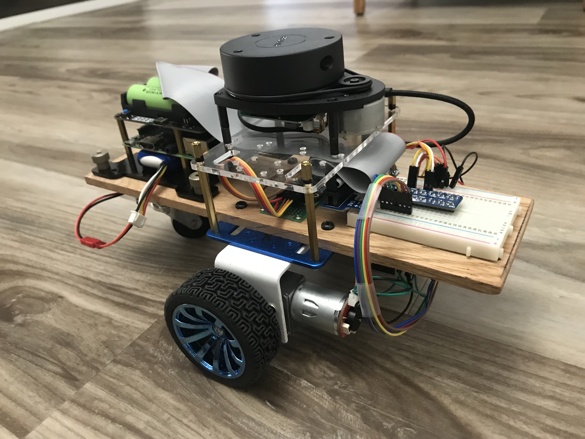

# Do-it-yourself differential drive ROS robot
This project started out when my wife bought me a Raspberry-Pi 4 (w/ 8GB RAM) for my birthday.
At the time, I was curious about learning ROS and I also wondered if the Raspi4
would be suitable for use as a desktop computer. Could the new Raspi handle the
rigors of running ROS, and if so, wouldn't that be great to enable me to pursue my ROS education?

The answer to both questions turned out to be YES, and so this inital curiosity has led me to tackle this project.

A Raspberry Pi 3B+ computer is used onboard the robot, while
the Raspi4 has found use as my desktop computer. Here's an early picture of the robot before the IMU was in place.

And here it is fully functional, powered up and ready to go.

Keeping in mind that my goal was to learn ROS (in general) and to build my first autonomous ROS mobile robot (in particular), I opted for the robot to be as simple as possible, with a preference for readily available components, assembled with minimal modification in a configuration that allows really easy access. I also realized that I wasn't smart enought to know at the outset what the final configuration was going to look like so I chose a configuration that made modifications simple. I deliberately avoided the urge to be clever and try to pack things too tightly into a small space.

The most complicated part I had to make was the 1/4 x 5 x 12 inch long piece of oak that I purchased from Home Depot. Using only moderate precision, I drilled holes wherever they were needed. Everything else is readily available as an off-the-shelf componenent. For example, the entire wheel/motor/encoder assembly including the lower blue anodized plate, the upper clear plastic plate and the brass standoffs came from an [Elegoo Tumbller](https://www.amazon.com/dp/B07QWJH77V?psc=1&ref=ppx_yo2_dt_b_product_details).

Along the way, I decided to use motors with a higher gear reduction, so I just had to make a pair of new motor brackets. Here is the robot in its most recent configuration.

### Configuring ROS on board the robot
The `my_robot` folder contains all the code that goes in robot's catkin_ws/src directory.

[Here](setup-operate/setup-2nd-computer.md) are the details of the configuration and setup of the robot onboard computer.

### Using the ROS Navigation Stack
This is where ROS really shines. This is what makes ROS so powerful. There is no need to reinvent all the robotics algorithms for yourself. With ROS, all the heavy lifting has been done. Just issue a couple simple commands and you get a map. A couple of clicks in RVIZ and ROS will take your robot from point A to point B (on the map that it made) without colliding with anything along the way, using sophisticated algoithms such as:
* SLAM / Mapping
* Localization using AMCL
* Path Planning to find the best route from initial pose to goal pose.

Navigation is launched from the `robo_nav` package, residing inside the `my_robot` folder. And there really isn't very much there. Just some launch files, parameters, and maps.

To operate the robot, refer to these [operating instructions](setup-operate/operate-robot.md).

[Here](setup-operate/ubuntu-install.md) are the details of the setup and configuration of the raspi4 computer.

### DIY robot makes its maiden voyage
On 11/27/21, the DIY robot made its first trip under the control of the ROS Navigation Stack. It wasn't a very smooth or efficient looking route but the robot managed to complete its first trip to a goal pose specified in RVIZ.

