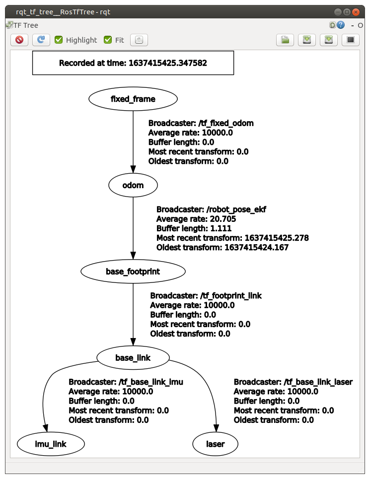

# Do-it-yourself differential drive ROS robot
This project started out when my wife bought me a Raspberry-Pi 4 (w/ 8GB RAM) for my birthday.
At the time, I was curious about learning ROS and I also wondered if the Raspi4
would be suitable for use as a desktop computer? Could the new Raspi handle the
rigors of running ROS, and if so, wouldn't that be great to enable me to pursue my ROS education?

The answer to both questions turned out to be YES, and so this inital curiosity
has led me to tackle this project.

This project actually uses a Raspberry Pi3B+ computer aboard the robot, while
the Raspi4 is still my dektop computer. Here's what the robot looks like.


I happen to be much more facile with Python than with C++, so wherever I have a
choice, I prefer to use Python for all my nodes. The 'my_robot' folder contains
all the code that goes in the robot's catkin_ws/src directory. After startin roscore, and with pigpiod running, I launch all the onboard nodes.

```
ssh ubuntu@robot
sudo pigpiod
roslaunch bringup bringup.launch
```



Then from my desktop:
* I launch rviz
* And send /cmd_vel commands with keyboard_telop


I will continue to fill in more details, but this will have to do for now.

-Doug
