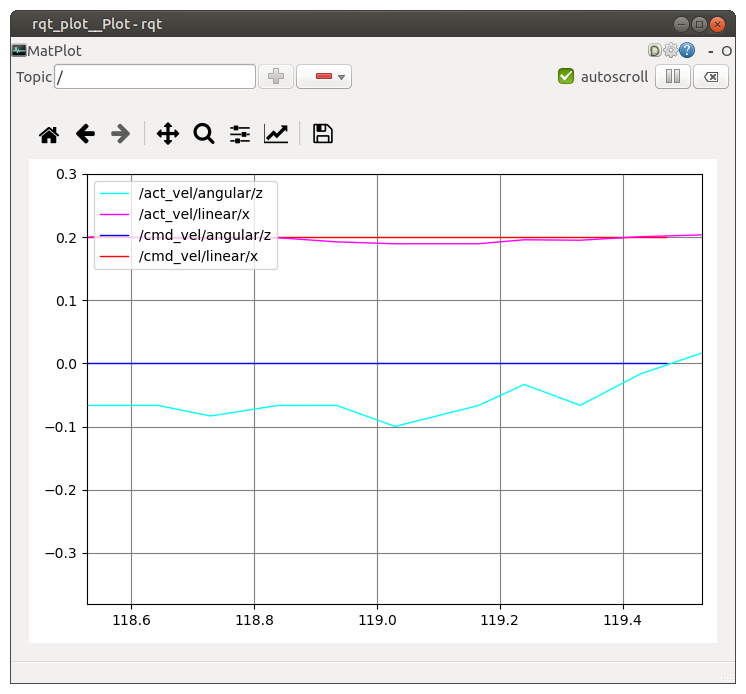

# Motor Speed Control
The main thing that we need to get right with our autonomous robot is to make sure the robot's actual velocity matches the commanded velocity. Without that, all bets are off when it comes to its performance while trying to navigate autonomously. Here is the process used to achieve this goal.
### In theory:
* Listen on the /cmd_vel topic for Twist message then find the two component parts:
    * linear velocity (meters/sec)
    * angualar velocity (radians/sec)
* Convert these two velocity components to velocities (meters/sec) at the right and left wheels.
* Convert right and left wheel velocities to right and left motor tick rates (ticks/sec).
* Perform a test to empirically discover the relationship between **tick_rates** and **spd** (the PWM signal sent to the motors).
    * Use motor calibrator tool to generate a .csv file containing this data.
    * From the generated values, populate the ROBOT_TRS_CURVE in robot_params pkg.
    * The relation between spd and tick_rate is very **soft**. It is easily influenced by both variations in load and intrinsic frictional variability from one motor to another.
* Because of these variations, a PID feedback loop is implemented. (This is analagous to cruise control on your car. You want your speed to stay steady regardless of whether you are going uphill or downhill.)
* Test to make sure the robot's actual velocity matches the commanded velocity.
    * Start roscore on raspi4: `roscore`
    * Place robot on the floor with plenty of space ahead
    * Log on to robot: `ssh ubuntu@robot`
        * Make sure pigpiod is running: `sudo pigpiod`
        * Start nodes on robot: `roslaunch bringup bringup.launch`
    * Start node to issue velocity commands on /cmd_vel topic: `rosrun rqt_robot_steering rqt_robot_steering`
    * Start node to monitor command and actual velocities: `rqt_plot`

### In practice:

At first, the motor calibrator test was run with the robot sitting up on blocks, so the wheels would spin freely.
The saved data file was opened in a spreadsheet and a scatter plot was generated.

.png)

Next, the robot was but on the floor with lots of space ahead of it. It can be seen from the plot below that the curve is much different. However, the curve below is more realistic than the no-load curve, so these values were used to populate the ROBOT_TRS_CURVE parameter.

Finally, the robot was driven forward at 0.2 m/s while monitoring the actual velocity. In the plot below, it can be seen that the PID loop is busy correcting the spd value being sent to the motors. This is noticeable as a small "wiggle" in the actual linear velocity as it tries to null the linear velocity error. It also manifests as a small wiggle in the angular velocity that occurs as a result.

If it is desired to see the spd and pid terms for the right and left motors printed out, the value of MTR_DEBUG can be set to True in the wheels/src/encoder_publisher.py file.

