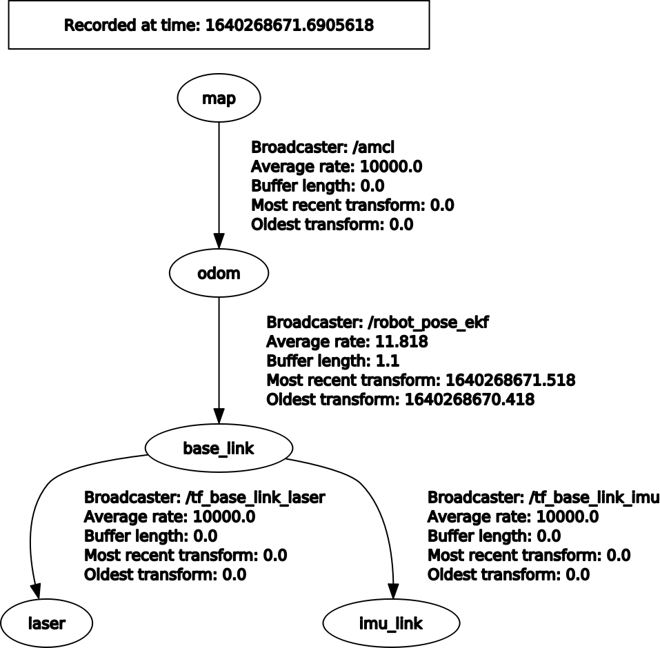

# Robot Operation / Current Status
This is intended to be an up-to-date summary of how to run the robot.

December 20, 2021
### SLAM Mapping

* Start roscore on raspi4: `roscore`

* Log on to robot: `ssh ubuntu@robot`
    * Make sure pigpiod is running: `sudo pigpiod`
    * Start nodes on robot: `roslaunch bringup bringup.launch`
    * Start gmapping: `roslaunch robo_nav gmapping.launch`
* Start RVIZ with saved config: `rviz -d ~/robot.rviz`
* Start keyboard teleop: `rosrun teleop_twist_keyboard teleop_twist_keyboard.py`
    * Or `rosrun rqt_robot_steering rqt_robot_steering`
* Drive around **slowly** to build map
* Save map (cd to maps folder): `rosrun map_server map_saver -f officemap`

### Navigation

* Start roscore on raspi4: `roscore`

* Log on to robot: `ssh ubuntu@robot`
    * Make sure pigpiod is running: `sudo pigpiod`
    * Start nodes on robot: `roslaunch bringup bringup.launch`
    * Start navigation: `roslaunch robot_nav navigation.launch` 
* Start RVIZ with saved config: `rviz -d ~/robot.rviz`

### Test Drive
Test drive pkg (installed on Raspi4) enables driving directly to a goal specified in RVIZ, but without regard for obstacles.

* Start roscore on raspi4: `roscore`

* Log on to robot: `ssh ubuntu@robot`
    * Make sure pigpiod is running: `sudo pigpiod`
    * Start nodes on robot: `roslaunch bringup bringup.launch`
    * Start map node on robot: `roslaunch robot_nav map.launch`

* Start test drive: `roslaunch test_drive test_drive.launch` 
* Start RVIZ with saved config: `rviz -d ~/robot.rviz`

### Show tf tree
* The tf tree shows the topological relationship of the various coordinate frames of reference that are used in the robot.

* To show tf tree: `rosrun rqt_tf_tree rqt_tf_tree`

